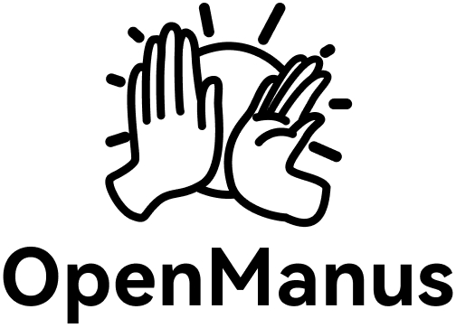

<p align="center">
  
</p>

English | [中文](README_zh.md) | [한국어](README_ko.md) | [日本語](README_ja.md)

[](https://github.com/mannaandpoem/OpenManus/stargazers)
&ensp;
[](https://opensource.org/licenses/MIT) &ensp;
[](https://discord.gg/DYn29wFk9z)
[](https://huggingface.co/spaces/lyh-917/OpenManusDemo)
[](https://doi.org/10.5281/zenodo.15186407)

# 👋 OpenManus

Manus is incredible, but OpenManus can achieve any idea without an *Invite Code* 🛫!

Our team members [@Xinbin Liang](https://github.com/mannaandpoem) and [@Jinyu Xiang](https://github.com/XiangJinyu) (core authors), along with [@Zhaoyang Yu](https://github.com/MoshiQAQ), [@Jiayi Zhang](https://github.com/didiforgithub), and [@Sirui Hong](https://github.com/stellaHSR), we are from [@MetaGPT](https://github.com/geekan/MetaGPT). The prototype is launched within 3 hours and we are keeping building!

It's a simple implementation, so we welcome any suggestions, contributions, and feedback!

Enjoy your own agent with OpenManus!

We're also excited to introduce [OpenManus-RL](https://github.com/OpenManus/OpenManus-RL), an open-source project dedicated to reinforcement learning (RL)- based (such as GRPO) tuning methods for LLM agents, developed collaboratively by researchers from UIUC and OpenManus.

## 🏗️ Multi-Agent Architecture

OpenManus features a sophisticated **multi-agent coordination system** that enables complex task execution through specialized AI agents working together:

### 🤖 Agent Types
- **Manus Agent**: Core coordination and general operations
- **Browser Agent**: Web navigation and data collection
- **SWE Agent**: Software engineering and code development
- **Data Analysis Agent**: Data processing and visualization

### 🔄 Flow Management
- **FlowFactory**: Creates and manages different flow types
- **Multi-Agent Flow**: Coordinates multiple agents for complex tasks
- **Single Agent Flow**: Handles simple tasks with one agent

### 🧠 Decision System
- **Task Complexity Analysis**: Automatically determines if task requires multiple agents
- **Agent Selection**: Chooses appropriate agents based on task requirements
- **Execution Planning**: Plans and coordinates agent interactions

### 🛠️ Coordination Tools
- **Distributed Memory**: Shared memory for agent communication
- **Planning Tool**: Strategic task planning capabilities
- **Coordination Tool**: Inter-agent communication and synchronization

### 📊 Performance Characteristics
- Supports concurrent agent execution
- Scales to handle complex multi-step tasks
- Real-time progress monitoring
- Automatic error recovery and fallbacks

### 💡 Usage Examples

**Simple Task (Single Agent)**
```python
"Calculate the square root of 144"
# → Uses Manus Agent only
```

**Complex Task (Multi-Agent)**
```python
"Research AI trends in 2025 and create a comprehensive report"
# → Uses Browser Agent + Manus Agent + coordination
```

**Very Complex Task (Full Multi-Agent)**
```python
"Research best practices for microservices, then create a Python implementation"
# → Uses Browser Agent + SWE Agent + Manus Agent + planning
```

## 📋 API Reference

### Core Endpoints

#### Health & System
- `GET /health` - Health check
- `GET /info` - System information
- `GET /agents` - Available agents

#### Tasks
- `POST /tasks` - Create new task
- `GET /tasks` - List all tasks
- `GET /tasks/{task_id}` - Get specific task
- `DELETE /tasks/{task_id}` - Delete task
- `POST /tasks/{task_id}/cancel` - Cancel task
- `POST /tasks/{task_id}/retry` - Retry failed task
- `GET /tasks/{task_id}/logs` - Get task logs
- `POST /analyze-complexity` - Analyze task complexity

#### Documents
- `POST /documents/upload` - Upload document
- `GET /documents/{doc_id}` - Get document info
- `DELETE /documents/{doc_id}` - Delete document
- `POST /documents/{doc_id}/process` - Process document
- `GET /documents/{doc_id}/download` - Download document

#### MCP Servers
- `GET /mcp/servers` - List MCP servers
- `POST /mcp/servers` - Create MCP server
- `PUT /mcp/servers/{server_id}` - Update MCP server
- `DELETE /mcp/servers/{server_id}` - Delete MCP server
- `POST /mcp/servers/{server_id}/connect` - Connect to server
- `POST /mcp/servers/{server_id}/disconnect` - Disconnect from server
- `GET /mcp/servers/{server_id}/tools` - Get server tools

#### WebSocket
- `WS /ws/{client_id}` - WebSocket connection for real-time updates

## 🏗️ Architecture Overview

OpenManus features a complete **5-pillar enterprise-grade architecture**:

### ✅ **Pillar 1: Backend Architecture**
- **Clean Architecture** with Domain-Driven Design (DDD)
- **FastAPI** with structured controllers, services, and repositories
- **Type-safe** Python with comprehensive error handling
- **API versioning** and standardized response patterns

### ✅ **Pillar 2: Frontend Architecture**
- **Feature-based structure** with React + TypeScript + Vite
- **Zustand** for predictable state management
- **Ant Design** components for consistent UI/UX
- **Modular component architecture** with hooks and contexts

### ✅ **Pillar 3: Communication System**
- **RobustWebSocket** with automatic reconnection and retry logic
- **Typed EventBus** for real-time updates between frontend and backend
- **Event-driven architecture** for task execution and system notifications
- **Connection state management** with graceful degradation

### ✅ **Pillar 4: Testing Strategy**
- **Test factories** for consistent mock data generation
- **Jest** configuration for React component testing
- **End-to-End (E2E)** test structure with Playwright
- **Type-safe test utilities** and comprehensive coverage

### ✅ **Pillar 5: DevOps & Deployment**
- **Docker containerization** for consistent development environments
- **Automated setup scripts** for quick project bootstrapping
- **CI/CD ready** configuration with development and production modes
- **Environment-based configuration** management

### 🔧 **Key Technical Features:**
- **Real-time WebSocket communication** for live task updates
- **Event-driven notifications** system for user feedback
- **Type-safe data flow** from database to UI components
- **Graceful error handling** and connection recovery
- **Scalable project structure** ready for enterprise deployment

## Project Demo

<video src="https://private-user-images.githubusercontent.com/61239030/420168772-6dcfd0d2-9142-45d9-b74e-d10aa75073c6.mp4?jwt=eyJhbGciOiJIUzI1NiIsInR5cCI6IkpXVCJ9.eyJpc3MiOiJnaXRodWIuY29tIiwiYXVkIjoicmF3LmdpdGh1YnVzZXJjb250ZW50LmNvbSIsImtleSI6ImtleTUiLCJleHAiOjE3NDEzMTgwNTksIm5iZiI6MTc0MTMxNzc1OSwicGF0aCI6Ii82MTIzOTAzMC80MjAxNjg3NzItNmRjZmQwZDItOTE0Mi00NWQ5LWI3NGUtZDEwYWE3NTA3M2M2Lm1wND9YLUFtei1BbGdvcml0aG09QVdTNC1ITUFDLVNIQTI1NiZYLUFtei1DcmVkZW50aWFsPUFLSUFWQ09EWUxTQTUzUFFLNFpBJTJGMjAyNTAzMDclMkZ1cy1lYXN0LTElMkZzMyUyRmF3czRfcmVxdWVzdCZYLUFtei1EYXRlPTIwMjUwMzA3VDAzMjIzOVomWC1BbXotRXhwaXJlcz0zMDAmWC1BbXotU2lnbmF0dXJlPTdiZjFkNjlmYWNjMmEzOTliM2Y3M2VlYjgyNDRlZDJmOWE3NWZhZjE1MzhiZWY4YmQ3NjdkNTYwYTU5ZDA2MzYmWC1BbXotU2lnbmVkSGVhZGVycz1ob3N0In0.UuHQCgWYkh0OQq9qsUWqGsUbhG3i9jcZDAMeHjLt5T4" data-canonical-src="https://private-user-images.githubusercontent.com/61239030/420168772-6dcfd0d2-9142-45d9-b74e-d10aa75073c6.mp4?jwt=eyJhbGciOiJIUzI1NiIsInR5cCI6IkpXVCJ9.eyJpc3MiOiJnaXRodWIuY29tIiwiYXVkIjoicmF3LmdpdGh1YnVzZXJjb250ZW50LmNvbSIsImtleSI6ImtleTUiLCJleHAiOjE3NDEzMTgwNTksIm5iZiI6MTc0MTMxNzc1OSwicGF0aCI6Ii82MTIzOTAzMC80MjAxNjg3NzItNmRjZmQwZDItOTE0Mi00NWQ5LWI3NGUtZDEwYWE3NTA3M2M2Lm1wND9YLUFtei1BbGdvcml0aG09QVdTNC1ITUFDLVNIQTI1NiZYLUFtei1DcmVkZW50aWFsPUFLSUFWQ09EWUxTQTUzUFFLNFpBJTJGMjAyNTAzMDclMkZ1cy1lYXN0LTElMkZzMyUyRmF3czRfcmVxdWVzdCZYLUFtei1EYXRlPTIwMjUwMzA3VDAzMjIzOVomWC1BbXotRXhwaXJlcz0zMDAmWC1BbXotU2lnbmF0dXJlPTdiZjFkNjlmYWNjMmEzOTliM2Y3M2VlYjgyNDRlZDJmOWE3NWZhZjE1MzhiZWY4YmQ3NjdkNTYwYTU5ZDA2MzYmWC1BbXotU2lnbmVkSGVhZGVycz1ob3N0In0.UuHQCgWYkh0OQq9qsUWqGsUbhG3i9jcZDAMeHjLt5T4" controls="controls" muted="muted" class="d-block rounded-bottom-2 border-top width-fit" style="max-height:640px; min-height: 200px"></video>

## 🚀 Installation & Quick Start

### Prerequisites
- Python 3.8+ with pip
- Node.js 18+ with npm (for frontend)
- Git
- Docker (optional, for containerized deployment)

### Quick Start (Recommended)

The easiest way to get OpenManus running with both frontend and backend:

```bash
# 1. Clone the repository
git clone https://github.com/mauriciochaiben/OpenManus.git
cd OpenManus

# 2. Run the automated setup
./start_dev.sh
```

This script will automatically:
- ✅ Check system dependencies (Python, Node.js)
- ✅ Create Python virtual environment
- ✅ Install all Python and Node.js dependencies
- ✅ Start both frontend and backend services
- ✅ Monitor service health

**That's it!** Your OpenManus instance will be running with:
- 🌐 Frontend: http://localhost:3000
- 📡 Backend API: http://localhost:8000
- 📚 API Documentation: http://localhost:8000/docs

### Alternative Setup Methods

#### 1. Python Setup Script (Recommended for Development)
```bash
# Complete setup with verification and health monitoring
python3 setup_and_run.py

# Backend only
python3 setup_and_run.py --backend-only

# Skip verification tests
python3 setup_and_run.py --skip-tests

# Force reinstall dependencies
python3 setup_and_run.py --force-reinstall
```

#### 2. Manual Setup

If you prefer manual setup:

1. Clone and create environment:
```bash
git clone https://github.com/mauriciochaiben/OpenManus.git
cd OpenManus
python3 -m venv .venv
source .venv/bin/activate  # On Unix/macOS
# Or on Windows: .venv\Scripts\activate
```

2. Install dependencies:
```bash
pip install -r requirements.txt
cd frontend && npm install && cd ..
```

3. Start services:
```bash
npm run dev
```

For conda users:

```bash
conda create -n open_manus python=3.12
conda activate open_manus
git clone https://github.com/mannaandpoem/OpenManus.git
cd OpenManus
pip install -r requirements.txt
```

## Configuration

OpenManus requires configuration for the LLM APIs it uses. The automated setup creates this for you, but you can also configure manually:

### 🔧 Automated Configuration

If you used the automated setup (`./setup_openmanus.sh`), the configuration file is automatically created at `config/config.toml`. You just need to add your API keys.

### 🛠️ Manual Configuration

1. Create the configuration file:
```bash
cp config/examples/config.example.toml config/config.toml
```

2. Edit `config/config.toml` to add your API keys and customize settings:

```toml
# Global LLM configuration
[llm]
model = "gpt-4o"
base_url = "https://api.openai.com/v1"
api_key = "sk-..."  # Replace with your actual API key
max_tokens = 4096
temperature = 0.0

# Optional configuration for specific LLM models
[llm.vision]
model = "gpt-4o"
base_url = "https://api.openai.com/v1"
api_key = "sk-..."  # Replace with your actual API key
```

### 🗝️ Supported API Providers

OpenManus supports multiple LLM providers:
- **OpenAI** (GPT-4, GPT-4o, etc.)
- **Anthropic** (Claude 3.5 Sonnet, etc.)
- **Azure OpenAI**
- **AWS Bedrock**
- **Ollama** (Local models)

See `config/examples/config.example.toml` for configuration examples for each provider.

## Quick Start

### 🚀 Complete Application (Frontend + Backend)

If you used the automated setup:

```bash
./dev.sh
```

Or using the existing development script:

```bash
./start_dev.sh
```

This will start:
- 🌐 **Frontend**: http://localhost:3000 (React application)
- 📡 **Backend**: http://localhost:8000 (FastAPI server)
- 📚 **API Docs**: http://localhost:8000/docs (OpenAPI documentation)

### 🐍 Backend Only

## Usage

#### 3. Docker Setup (Optional)
```bash
# Build and run with Docker Compose
docker-compose up --build

# Or run individual services
docker build -t openmanus-backend .
docker run -p 8000:8000 openmanus-backend
```

### 🔑 Environment Configuration

OpenManus uses environment-specific configuration files:

- `config/config.toml` - Base configuration
- `config/development.toml` - Development overrides
- `config/production.toml` - Production overrides

#### Configuration Structure
```toml
# LLM Configuration
[llm]
model = "gpt-4o"
api_key = "your-api-key"
base_url = "https://api.openai.com/v1"

# Search Configuration
[search]
api_key = "your-search-api-key"

# Browser Configuration
[browser]
headless = true
timeout = 30

# MCP Configuration
[mcp]
servers_config_file = "config/mcp.specialized.json"
```

### 🚀 Running OpenManus

After installation, you can use OpenManus in several ways:

#### Web Interface (Recommended)
After running `./start_dev.sh`, access the web interface at:
- Frontend: http://localhost:3000
- Backend API: http://localhost:8000/docs

#### Command Line Interface
For terminal-based interaction:

```bash
python main.py
```

#### MCP Server Mode
For Model Context Protocol tools:
```bash
python run_mcp_server.py
```

## Project Structure

```
OpenManus/
├── 📱 frontend/          # React frontend application
├── 🐍 app/              # Python backend application
│   ├── agent/          # AI agent implementations
│   ├── api/            # FastAPI routes and controllers
│   ├── flow/           # Multi-agent workflows
│   ├── mcp/            # Model Context Protocol server
│   ├── services/       # Business logic services
│   └── tool/           # Tools and utilities
├── ⚙️ config/           # Configuration files
├── 📚 docs/             # Documentation
├── 🧪 tests/            # Test suite
├── 📄 scripts/          # Utility scripts
├── 📄 main.py           # Main CLI application
├── 🚀 start_dev.sh      # Development launcher
└── 📚 README.md         # This file
```

## 🔧 Development Guide

### Getting Started with Development

1. **Complete Setup**: Run the automated setup first
   ```bash
   ./setup_openmanus.sh
   ```

2. **Start Development Environment**:
   ```bash
   ./dev.sh
   ```

3. **VS Code Integration**: If using VS Code, you can use the built-in task:
   - Open Command Palette (`Cmd+Shift+P`)
   - Run "Tasks: Run Task"
   - Select "start-openmanus-dev"

### 🧪 Running Tests

The project includes comprehensive tests for both backend and frontend:

```bash
# Activate virtual environment
source .venv/bin/activate

# Run all backend tests
python -m pytest tests/ -v

# Run specific test categories
python -m pytest tests/test_basic_functionality.py -v
python -m pytest tests/test_multi_agent.py -v
python -m pytest tests/sandbox/ -v

# Frontend tests (if dependencies are installed)
cd frontend && npm test
```

## 🔧 Development Guide

### Getting Started with Development

1. **Complete Setup**: Run the automated setup first
   ```bash
   ./start_dev.sh
   ```

2. **Start Development Environment**:
   ```bash
   ./dev.sh
   ```

3. **VS Code Integration**: If using VS Code, you can use the built-in task:
   - Open Command Palette (`Cmd+Shift+P`)
   - Run "Tasks: Run Task"
   - Select "start-openmanus-dev"

### 🧪 Running Tests

The project includes comprehensive tests for both backend and frontend:

```bash
# Activate virtual environment
source .venv/bin/activate

# Run all backend tests
python -m pytest tests/ -v

# Run specific test categories
python -m pytest tests/test_basic_functionality.py -v
python -m pytest tests/test_multi_agent.py -v
python -m pytest tests/sandbox/ -v

# Frontend tests (if dependencies are installed)
cd frontend && npm test
```

### 🚀 Pre-commit Hooks Setup

OpenManus uses pre-commit hooks to maintain code quality and consistency:

#### Installation
```bash
# Install pre-commit (if not already installed)
pip install pre-commit

# Install the hooks
pre-commit install

# Optional: Install commit-msg hook for conventional commits
pre-commit install --hook-type commit-msg
```

#### Configured Hooks
- **Python Backend**: Ruff linting and formatting, MyPy type checking, Bandit security checks
- **Frontend**: ESLint, Prettier formatting
- **General**: YAML/JSON/TOML validation, trailing whitespace, file permissions

#### Usage
```bash
# Run hooks on all files
pre-commit run --all-files

# Hooks run automatically on git commit
git commit -m "your message"

# Skip hooks (not recommended)
git commit -m "your message" --no-verify
```

### 🛠️ Development Workflow

1. **Feature Development**:
   ```bash
   # Create feature branch
   git checkout -b feature/your-feature-name

   # Start development environment
   ./start_dev.sh

   # Make changes and test
   python -m pytest tests/ -v

   # Run pre-commit checks
   pre-commit run --all-files

   # Commit and push
   git add .
   git commit -m "feat: add your feature"
   git push origin feature/your-feature-name
   ```

2. **Debugging**:
   - Backend logs: Check `logs/` directory
   - Frontend: Use browser developer tools
   - API testing: http://localhost:8000/docs

3. **Adding New Features**:
   - Backend: Add to appropriate module in `app/`
   - Frontend: Add components in `frontend/src/`
   - Tests: Add corresponding tests in `tests/`
   - Documentation: Update relevant documentation

### 📁 Project Architecture

```
OpenManus/
├── 🌐 Frontend (React + TypeScript)
│   ├── src/components/     # React components
│   ├── src/pages/         # Page components
│   ├── src/services/      # API services
│   └── src/types/         # TypeScript definitions
│
├── 🐍 Backend (FastAPI + Python)
│   ├── app/agent/         # AI agent implementations
│   │   ├── manus.py       # Main agent class
│   │   ├── decision.py    # Multi-agent decision system
│   │   └── browser.py     # Browser automation agent
│   ├── app/flow/          # Multi-agent workflows
│   ├── app/sandbox/       # Secure code execution
│   ├── app/tool/          # Tools and utilities
│   └── app/mcp/           # Model Context Protocol
│
├── ⚙️ Configuration
│   ├── config/config.toml # Main configuration
│   └── config/examples/   # Configuration examples
│
└── 🧪 Tests
    ├── tests/frontend/    # Frontend tests
    ├── tests/sandbox/     # Sandbox tests
    └── tests/*.py         # Backend tests
```

### 🛠️ Development Workflow

1. **Feature Development**:
   ```bash
   # Create feature branch
   git checkout -b feature/your-feature-name

   # Start development environment
   ./dev.sh

   # Make changes and test
   python -m pytest tests/ -v

   # Commit and push
   git add .
   git commit -m "feat: add your feature"
   git push origin feature/your-feature-name
   ```

2. **Debugging**:
   - Backend logs: Check `logs/` directory
   - Frontend: Use browser developer tools
   - API testing: http://localhost:8000/docs

3. **Adding New Features**:
   - Backend: Add to appropriate module in `app/`
   - Frontend: Add components in `frontend/src/`
   - Tests: Add corresponding tests in `tests/`

## How to contribute

We welcome any friendly suggestions and helpful contributions!

### 🤝 Contributing Guidelines

1. **Fork and Clone**:
   ```bash
   git clone https://github.com/YOUR_USERNAME/OpenManus.git
   cd OpenManus
   ./start_dev.sh
   ```

2. **Development Setup**:
   - Follow the installation guide above
   - Run tests to ensure everything works: `python -m pytest tests/ -v`
   - Set up pre-commit hooks: `pre-commit install`
   - Create a feature branch for your changes

3. **Code Standards**:
   - **Python**: Follow PEP 8, use type hints, run `ruff check` and `mypy`
   - **TypeScript**: Follow project ESLint configuration
   - **Testing**: Add tests for new functionality (pytest for backend, Jest for frontend)
   - **Documentation**: Update documentation as needed
   - **Commits**: Use conventional commit format (feat:, fix:, docs:, etc.)

4. **Pull Request Process**:
   - Ensure all tests pass: `python -m pytest tests/ -v`
   - Run pre-commit checks: `pre-commit run --all-files`
   - Provide clear description of changes
   - Reference any related issues
   - Ensure your branch is up to date with main

5. **Areas for Contribution**:
   - 🐛 Bug fixes and performance improvements
   - ✨ New agent capabilities and tools
   - 📚 Documentation improvements and translations
   - 🧪 Test coverage and quality assurance
   - 🌐 Internationalization (i18n) support
   - 🎨 UI/UX improvements and accessibility
   - 🔌 New MCP server integrations
   - 🤖 Multi-agent workflow enhancements

### 📞 Community & Support

- 📧 **Email**: mannaandpoem@gmail.com
- 💬 **Discord**: [Join our community](https://discord.gg/DYn29wFk9z)
- 🐛 **Issues**: [GitHub Issues](https://github.com/mannaandpoem/OpenManus/issues)
- 📖 **Documentation**: Check the `docs/` directory for detailed guides
- 🚀 **Demos**: Try our [Hugging Face Demo](https://huggingface.co/spaces/lyh-917/OpenManusDemo)

### 🔧 Troubleshooting

#### Common Issues

**Installation Problems:**
```bash
# If Python dependencies fail
pip install --upgrade pip
pip install -r requirements.txt

# If Node.js dependencies fail
cd frontend && npm install --legacy-peer-deps

# If pre-commit hooks fail
pre-commit clean
pre-commit install
```

**Runtime Issues:**
```bash
# Check service status
curl http://localhost:8000/health
curl http://localhost:3000

# View logs
tail -f logs/app.log

# Restart services
./start_dev.sh
```

**Configuration Issues:**
- Ensure `config/config.toml` exists and has valid API keys
- Check environment variables are set correctly
- Verify network connectivity for external APIs

### 📊 Performance & Monitoring

OpenManus includes built-in monitoring and performance tracking:

- **Real-time WebSocket updates** for task progress
- **Health check endpoints** for service monitoring
- **Comprehensive logging** with configurable levels
- **Metrics collection** for task execution times
- **Error tracking** with detailed stack traces

## 🚀 Deployment

### Development Deployment
```bash
# Quick development setup
./start_dev.sh

# With custom configuration
ENVIRONMENT=development python3 setup_and_run.py
```

### Production Deployment
```bash
# Using Docker Compose (recommended)
docker-compose -f docker-compose.prod.yml up -d

# Manual production setup
ENVIRONMENT=production python3 setup_and_run.py --backend-only

# Build frontend for production
cd frontend && npm run build
```

### Environment Variables
```bash
# Core configuration
ENVIRONMENT=production
LOG_LEVEL=INFO
API_HOST=0.0.0.0
API_PORT=8000

# External services
OPENAI_API_KEY=your_openai_key
ANTHROPIC_API_KEY=your_anthropic_key
```

## Community Group
Join our networking group on Feishu and share your experience with other developers!

<div align="center" style="display: flex; gap: 20px;">
    
</div>

## Star History

[](https://star-history.com/#mannaandpoem/OpenManus&Date)

## Sponsors
Thanks to [PPIO](https://ppinfra.com/user/register?invited_by=OCPKCN&utm_source=github_openmanus&utm_medium=github_readme&utm_campaign=link) for computing source support.
> PPIO: The most affordable and easily-integrated MaaS and GPU cloud solution.


## Acknowledgement

Thanks to [anthropic-computer-use](https://github.com/anthropics/anthropic-quickstarts/tree/main/computer-use-demo)
and [browser-use](https://github.com/browser-use/browser-use) for providing basic support for this project!

Additionally, we are grateful to [AAAJ](https://github.com/metauto-ai/agent-as-a-judge), [MetaGPT](https://github.com/geekan/MetaGPT), [OpenHands](https://github.com/All-Hands-AI/OpenHands) and [SWE-agent](https://github.com/SWE-agent/SWE-agent).

We also thank stepfun(阶跃星辰) for supporting our Hugging Face demo space.

OpenManus is built by contributors from MetaGPT. Huge thanks to this agent community!

## Cite
```bibtex
@misc{openmanus2025,
  author = {Xinbin Liang and Jinyu Xiang and Zhaoyang Yu and Jiayi Zhang and Sirui Hong and Sheng Fan and Xiao Tang},
  title = {OpenManus: An open-source framework for building general AI agents},
  year = {2025},
  publisher = {Zenodo},
  doi = {10.5281/zenodo.15186407},
  url = {https://doi.org/10.5281/zenodo.15186407},
}
```
